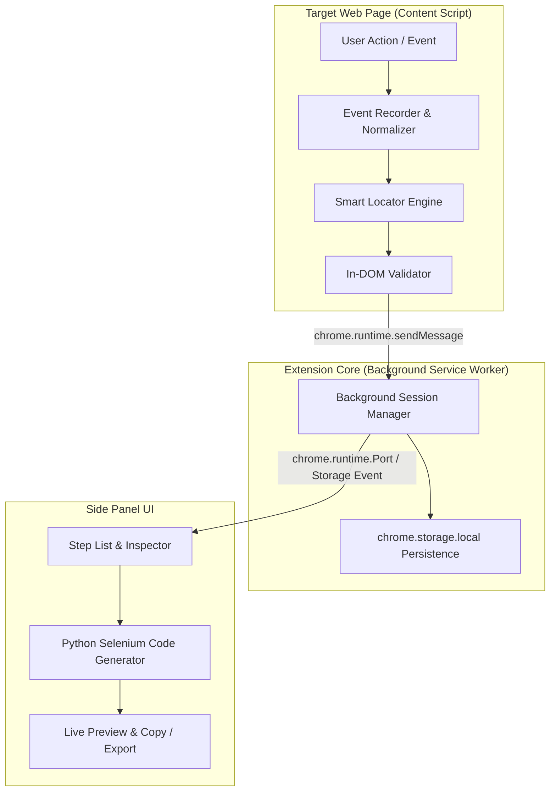

# Selenium Python Test Recorder Implementation Plan

> **For agentic workers:** REQUIRED SUB-SKILL: Use superpowers:subagent-driven-development to implement this plan task-by-task. Steps use checkbox (`- [ ]`) syntax for tracking.

**Goal:** Build a production-grade Chrome Manifest V3 Extension that records user browser actions and generates robust, flake-free, PEP 8-compliant Python Selenium test scripts using explicit waits.

**Architecture:** A decoupled pipeline where browser events captured by content scripts are normalized into an Intermediate Representation (`TestCaseModel`), verified by a real-time DOM locator validator, managed persistently in a background service worker, and surfaced in a live Side Panel that generates Python code.

**Architecture Diagram:**

**Tech Stack:**
- **Language**: TypeScript 5+
- **Bundler**: Vite 6+ with `@crxjs/vite-plugin`
- **Target Runtime**: Chrome MV3 (Side Panel API, Service Worker, Content Scripts)
- **Testing**: Vitest + JSDOM for comprehensive TDD revalidation
- **Code Output Target**: Python 3.10+ / Selenium 4.x (Explicit Waits: `WebDriverWait` + `EC`)

**Spec:** [docs/superpowers/specs/2026-09-27-selenium-python-recorder-design.md](file:///c:/Users/KING/Documents/GitHub/chrome-driver/docs/superpowers/specs/2026-09-27-selenium-python-recorder-design.md)

## Global Constraints

- Manifest Version: 3 (`manifest_version: 3`)
- Side Panel: Uses Chrome `sidePanel` API (`sidepanel.html`)
- Zero `time.sleep()` in generated code by default; all waits use `WebDriverWait(driver, 10).until(EC...)`
- Sensitive fields (`password`, `credit-card`, `token`) must never be saved as plain text; generate `os.getenv(...)`
- All modules must be tested with Vitest before marked complete

---

### Task 1: Project Scaffolding & Build Configuration

**Files:**
- Create: `package.json`
- Create: `tsconfig.json`
- Create: `vite.config.ts`
- Create: `manifest.json`
- Create: `vitest.config.ts`

**Interfaces:**
- Produces: Working build (`npm run build`) producing extension bundle in `dist/` and working test runner (`npm test`).

- [ ] **Step 1: Create `package.json`**
Define scripts (`dev`, `build`, `test`) and dependencies (`typescript`, `vite`, `@crxjs/vite-plugin`, `vitest`, `jsdom`).
- [ ] **Step 2: Create `tsconfig.json` and `vite.config.ts`**
Configure modern ESNext modules, DOM types, and Chrome runtime types.
- [ ] **Step 3: Create `manifest.json`**
Configure MV3 extension with side panel, background service worker, and permissions (`sidePanel`, `storage`, `activeTab`, `scripting`).
- [ ] **Step 4: Install dependencies and verify build/test commands**
Run `npm install`, then run `npm test` to confirm Vitest runner initializes.
- [ ] **Step 5: Commit**
`git add package.json tsconfig.json vite.config.ts manifest.json vitest.config.ts && git commit -m "chore: scaffold project with vite, crxjs and vitest"`

---

### Task 2: Core Data Models & Message Contracts

**Files:**
- Create: `src/types/model.ts`
- Create: `src/types/messages.ts`
- Test: `tests/models.test.ts`

**Interfaces:**
- Produces: `LocatorStrategy`, `LocatorCandidate`, `ActionType`, `TestStep`, `TestCaseModel`, and extension `MessagePayload` types.

- [ ] **Step 1: Write the failing type contract test in `tests/models.test.ts`**
Assert factory helpers instantiate valid default `TestCaseModel` objects with timestamps, timeout settings, and empty step arrays.
- [ ] **Step 2: Run test to verify it fails**
Run `npx vitest run tests/models.test.ts`. Expected: FAIL (modules not found).
- [ ] **Step 3: Implement `src/types/model.ts` and `src/types/messages.ts`**
Create clean interfaces for candidate locators, actions, steps, and messages (`START_RECORDING`, `STOP_RECORDING`, `RECORDED_STEP`, `GET_SESSION_STATE`).
- [ ] **Step 4: Run test to verify it passes**
Run `npx vitest run tests/models.test.ts`. Expected: PASS.
- [ ] **Step 5: Commit**
`git commit -m "feat: define core test case data models and message schemas"`

---

### Task 3: Smart Locator Engine & DOM Validator (TDD)

**Files:**
- Create: `src/content/locator-engine.ts`
- Create: `src/content/locator-validator.ts`
- Test: `tests/locator-engine.test.ts`

**Interfaces:**
- Consumes: `TargetElementModel`, `LocatorCandidate` from `src/types/model.ts`.
- Produces: `generateLocators(element: HTMLElement): LocatorCandidate[]` and `validateLocator(candidate: LocatorCandidate, root?: Document): LocatorValidationResult`.

- [ ] **Step 1: Write failing tests in `tests/locator-engine.test.ts`**
Cover:
  - Standard element with unique ID (`#username`).
  - Dynamic ID element (`input-928374` or `ember123`) -> flags `dynamic_id` and prefers `name` or `data-testid`.
  - Element with `data-testid="submit-btn"`.
  - Duplicate classes / elements -> verifies `isUnique: false` and `matchCount > 1`.
  - Button with text -> generates semantic relative XPath `//button[normalize-space()='Save']`.
- [ ] **Step 2: Run test to verify it fails**
Run `npx vitest run tests/locator-engine.test.ts`. Expected: FAIL.
- [ ] **Step 3: Implement `locator-engine.ts` and `locator-validator.ts`**
Write candidate generator with ID, test attributes, name, aria, CSS, and XPath. Write validator that queries the DOM and marks uniqueness.
- [ ] **Step 4: Run test to verify it passes**
Run `npx vitest run tests/locator-engine.test.ts`. Expected: PASS.
- [ ] **Step 5: Commit**
`git commit -m "feat: implement smart locator engine and dom validator with tests"`

---

### Task 4: Action Normalizer & Event Recorder (TDD)

**Files:**
- Create: `src/content/action-normalizer.ts`
- Create: `src/content/event-recorder.ts`
- Test: `tests/action-normalizer.test.ts`

**Interfaces:**
- Consumes: `generateLocators` from Task 3, types from Task 2.
- Produces: `ActionNormalizer` class with `normalizeClick()`, `normalizeType()`, `flushInputBuffer()`.

- [ ] **Step 1: Write failing tests in `tests/action-normalizer.test.ts`**
Cover:
  - Debouncing multiple clicks on identical target within 300ms (collapses to 1 step).
  - Keystroke buffering (aggregates typing into a single `type` step with final value).
  - Password field detection (`type="password"`) -> sets `isSensitive: true`, masks value.
  - Checkbox selection detection (`is_selected`).
- [ ] **Step 2: Run test to verify it fails**
Run `npx vitest run tests/action-normalizer.test.ts`. Expected: FAIL.
- [ ] **Step 3: Implement `action-normalizer.ts` and `event-recorder.ts`**
Add event listeners (`click`, `input`, `change`, `blur`), debouncing timers, and sensitive field masking.
- [ ] **Step 4: Run test to verify it passes**
Run `npx vitest run tests/action-normalizer.test.ts`. Expected: PASS.
- [ ] **Step 5: Commit**
`git commit -m "feat: implement action normalizer and event recorder with tests"`

---

### Task 5: Python Selenium Code Generator (TDD)

**Files:**
- Create: `src/generator/python-generator.ts`
- Test: `tests/python-generator.test.ts`

**Interfaces:**
- Consumes: `TestCaseModel`, `TestStep` from `src/types/model.ts`.
- Produces: `generateSeleniumScript(testCase: TestCaseModel): string`.

- [ ] **Step 1: Write failing tests in `tests/python-generator.test.ts`**
Verify generated Python script:
  - Includes standard imports (`webdriver`, `By`, `WebDriverWait`, `EC`).
  - Generates `WebDriverWait(driver, 10).until(EC.element_to_be_clickable(...)).click()` for clicks.
  - Generates `element.clear()` followed by `element.send_keys(...)` for inputs.
  - Handles `isSensitive: true` by generating `os.getenv("TEST_PASSWORD")` without plain text passwords.
  - Contains ZERO occurrences of `time.sleep()`.
- [ ] **Step 2: Run test to verify it fails**
Run `npx vitest run tests/python-generator.test.ts`. Expected: FAIL.
- [ ] **Step 3: Implement `python-generator.ts`**
Generate formatted Python Selenium code adhering to PEP 8.
- [ ] **Step 4: Run test to verify it passes**
Run `npx vitest run tests/python-generator.test.ts`. Expected: PASS.
- [ ] **Step 5: Commit**
`git commit -m "feat: implement python selenium generator with explicit waits and tests"`

---

### Task 6: Background Service Worker & State Synchronization

**Files:**
- Create: `src/background/service-worker.ts`
- Test: `tests/service-worker.test.ts`

**Interfaces:**
- Consumes: Message contracts from `src/types/messages.ts`, `TestCaseModel` from `src/types/model.ts`.
- Produces: Active session state management, `chrome.storage.local` persistence, multi-tab navigation survival.

- [ ] **Step 1: Write failing test in `tests/service-worker.test.ts`**
Simulate messages (`START_RECORDING`, `STEP_RECORDED`, `STOP_RECORDING`) and verify test case state accumulates and persists.
- [ ] **Step 2: Run test to verify it fails**
Run `npx vitest run tests/service-worker.test.ts`. Expected: FAIL.
- [ ] **Step 3: Implement `service-worker.ts`**
Handle extension lifecycle, action appending, side panel communication ports, and storage syncing.
- [ ] **Step 4: Run test to verify it passes**
Run `npx vitest run tests/service-worker.test.ts`. Expected: PASS.
- [ ] **Step 5: Commit**
`git commit -m "feat: implement background service worker and session persistence"`

---

### Task 7: Chrome Side Panel UI

**Files:**
- Create: `src/sidepanel/index.html`
- Create: `src/sidepanel/style.css`
- Create: `src/sidepanel/index.ts`
- Create: `src/sidepanel/ui-renderer.ts`
- Test: `tests/ui-renderer.test.ts`

**Interfaces:**
- Consumes: `TestCaseModel`, `generateSeleniumScript`.
- Produces: Interactive Side Panel with Start/Stop controls, live Step List with locator badges, and live Python code preview with Copy to Clipboard button.

- [ ] **Step 1: Write test for `ui-renderer.ts` in `tests/ui-renderer.test.ts`**
Verify HTML rendering of step cards, action badges, and locator strategy dropdowns.
- [ ] **Step 2: Run test to verify it passes or fails**
Run `npx vitest run tests/ui-renderer.test.ts`.
- [ ] **Step 3: Implement Side Panel HTML, CSS, and TypeScript logic**
Build a sleek dark-themed UI with status indicator (🔴 Recording / ⚪ Idle), step list, Python syntax box, and Copy button.
- [ ] **Step 4: Run build to verify bundle integration**
Run `npm run build` to ensure Vite bundles the sidepanel and content scripts cleanly.
- [ ] **Step 5: Commit**
`git commit -m "feat: implement chrome side panel recording and preview ui"`

---

### Task 8: End-to-End Revalidation Demo Page & Test Suite

**Files:**
- Create: `test-pages/demo-app.html`
- Create: `tests/e2e-simulation.test.ts`

**Interfaces:**
- Produces: Live test fixture web page and simulated recording test demonstrating complete flow: Hover -> Click -> Type -> Validate Locator -> Generate Python -> Assert Python code validity.

- [ ] **Step 1: Create `test-pages/demo-app.html`**
Form containing username, password, remember-me checkbox, dynamic buttons, and delay-loaded components.
- [ ] **Step 2: Write `tests/e2e-simulation.test.ts`**
Simulate loading `demo-app.html`, recording actions, asserting locators are unique, and verifying generated Python code contains all expected explicit wait steps and masked secrets.
- [ ] **Step 3: Run all project test suites**
Run `npm test` and ensure 100% test passing across all modules.
- [ ] **Step 4: Commit**
`git commit -m "test: add demo test page and complete e2e simulation revalidation"`
